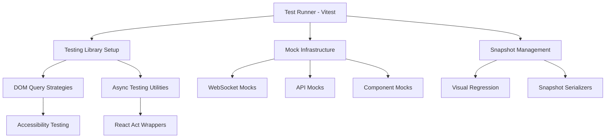

# Frontend Test Infrastructure Improvements - Design

## Overview

This design outlines the technical approach to systematically fix the 65 failed frontend tests and 9 failed snapshots by improving the testing infrastructure, implementing modern React testing practices, and ensuring accessibility compliance.

## Architecture

### Testing Infrastructure Components



## Components and Interfaces

### 1. Enhanced Testing Library Configuration

**File: `src/test/setup.ts`**
```typescript
// Enhanced setup with proper cleanup and modern practices
import { cleanup } from '@testing-library/react'
import { afterEach, beforeEach } from 'vitest'

// Automatic cleanup after each test
afterEach(() => {
  cleanup()
})

// Configure Testing Library with better defaults
configure({
  testIdAttribute: 'data-testid',
  asyncUtilTimeout: 5000, // Increased timeout for async operations
  computedStyleSupportsPseudoElements: true
})
```

### 2. WebSocket Testing Infrastructure

**File: `src/test/mocks/websocket.ts`**
```typescript
export class MockWebSocket {
  static instances: MockWebSocket[] = []
  
  constructor(url: string) {
    MockWebSocket.instances.push(this)
    // Simulate connection lifecycle
  }
  
  // Mock WebSocket API methods
  send = vi.fn()
  close = vi.fn()
  addEventListener = vi.fn()
  removeEventListener = vi.fn()
  
  // Helper methods for testing
  simulateMessage(data: any) {
    // Trigger message handlers
  }
  
  simulateConnection() {
    // Trigger open handlers
  }
  
  simulateDisconnection() {
    // Trigger close handlers
  }
}
```

### 3. Accessibility Testing Utilities

**File: `src/test/utils/accessibility.ts`**
```typescript
import { axe, toHaveNoViolations } from 'jest-axe'

expect.extend(toHaveNoViolations)

export const checkAccessibility = async (container: HTMLElement) => {
  const results = await axe(container, {
    rules: {
      // Configure WCAG 2.1 AA compliance
      'color-contrast': { enabled: true },
      'keyboard-navigation': { enabled: true },
      'aria-labels': { enabled: true }
    }
  })
  
  expect(results).toHaveNoViolations()
}

export const addAccessibleLabels = (element: HTMLElement, label: string) => {
  // Helper to add proper ARIA labels
  element.setAttribute('aria-label', label)
}
```

### 4. Visual Regression Test Configuration

**File: `vitest.config.ts` (updated)**
```typescript
export default defineConfig({
  test: {
    environment: 'jsdom',
    setupFiles: ['src/test/setup.ts'],
    // Snapshot configuration for consistency
    snapshotFormat: {
      escapeString: false,
      printBasicPrototype: false
    }
  }
})
```

## Data Models

### Test Configuration Models

```typescript
interface TestEnvironmentConfig {
  viewport: {
    width: number
    height: number
  }
  accessibility: {
    level: 'AA' | 'AAA'
    rules: string[]
  }
  snapshots: {
    threshold: number
    updateMode: 'none' | 'new' | 'all'
  }
}

interface MockWebSocketConfig {
  autoConnect: boolean
  connectionDelay: number
  messageDelay: number
}
```

## Error Handling

### 1. Testing Library Query Failures
```typescript
// Replace immediate queries with async alternatives
// Before: screen.getByText('Connecting...')
// After: await screen.findByText('Connecting...', {}, { timeout: 3000 })

export const waitForElement = async (query: () => HTMLElement, timeout = 5000) => {
  return waitFor(query, { timeout })
}
```

### 2. WebSocket Connection State Handling
```typescript
export const waitForWebSocketState = async (
  expectedState: 'connecting' | 'connected' | 'disconnected',
  timeout = 3000
) => {
  return waitFor(
    () => {
      const statusElement = screen.getByTestId('websocket-status')
      expect(statusElement).toHaveTextContent(expectedState)
    },
    { timeout }
  )
}
```

### 3. React Act Wrapper Utilities
```typescript
import { act } from 'react'

export const actAsync = async (callback: () => Promise<void>) => {
  await act(async () => {
    await callback()
  })
}

export const actSync = (callback: () => void) => {
  act(() => {
    callback()
  })
}
```

## Testing Strategy

### 1. DOM Query Strategy
- **Use `findBy*` queries** for elements that appear asynchronously
- **Use `queryBy*` queries** when testing for absence
- **Use `getBy*` queries** only for elements that should be immediately present
- **Add proper `data-testid` attributes** for reliable element selection

### 2. WebSocket Testing Strategy
- **Mock WebSocket globally** in test setup
- **Provide helper methods** to simulate connection states
- **Test connection lifecycle** (connecting → connected → disconnected)
- **Verify message handling** without actual network calls

### 3. Accessibility Testing Strategy
- **Run axe-core checks** on all rendered components
- **Add proper ARIA labels** to form controls and interactive elements
- **Ensure keyboard navigation** works for all interactive elements
- **Test screen reader compatibility** with semantic HTML

### 4. Visual Regression Strategy
- **Standardize viewport sizes** across test environments
- **Use consistent data** for snapshot tests
- **Implement snapshot update workflow** for intentional changes
- **Configure threshold tolerance** for minor rendering differences

### 5. React Testing Modernization
- **Wrap state updates in `act()`** calls
- **Use modern Testing Library APIs** (avoid deprecated methods)
- **Handle concurrent features** properly with React 18+
- **Implement proper cleanup** in test teardown

## Implementation Plan

### Phase 1: Core Infrastructure
1. Update test setup and configuration files
2. Implement WebSocket mocking infrastructure
3. Add accessibility testing utilities
4. Configure snapshot testing properly

### Phase 2: Query Issue Resolution
1. Audit all `getByText` and similar queries
2. Replace with appropriate async alternatives
3. Add proper waiting strategies
4. Implement retry mechanisms for flaky queries

### Phase 3: Accessibility Compliance
1. Add missing ARIA labels to form controls
2. Implement proper button naming
3. Add semantic HTML structure
4. Configure axe-core rules for WCAG compliance

### Phase 4: Visual Regression Stabilization
1. Update outdated snapshots
2. Configure consistent rendering environment
3. Implement snapshot update workflow
4. Add snapshot diff review process

### Phase 5: React Testing Modernization
1. Replace deprecated Testing Library APIs
2. Add proper `act()` wrappers
3. Handle React 18 concurrent features
4. Implement modern async testing patterns

## Performance Considerations

- **Parallel test execution** with proper isolation
- **Efficient mock cleanup** between tests
- **Optimized snapshot generation** with minimal DOM
- **Fast accessibility checks** with focused rule sets
- **Cached WebSocket mock instances** for reuse

## Security Considerations

- **No hardcoded secrets** in test files
- **Sanitized test data** without real user information
- **Secure mock implementations** that don't expose real endpoints
- **Proper cleanup** of sensitive test state