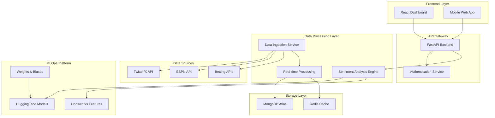

# Design Document

## Overview

The NFL Sentiment Analyzer improvement design transforms the current basic FastAPI application into a comprehensive, production-ready platform. The architecture follows modern microservices patterns with proper separation of concerns, implementing real-time data processing, advanced ML pipelines, and a responsive frontend dashboard.

The system will maintain the existing FastAPI backend while adding a React frontend, implementing proper authentication, integrating multiple data sources, and establishing MLOps workflows for continuous model improvement.

## Architecture

### High-Level Architecture



### Service Architecture

The application follows a modular architecture with the following core services:

1. **Frontend Service**: React-based dashboard with real-time updates
2. **API Service**: Enhanced FastAPI backend with comprehensive endpoints
3. **Authentication Service**: JWT-based auth with role management
4. **Data Ingestion Service**: Real-time data collection from multiple sources
5. **Sentiment Analysis Service**: ML-powered sentiment processing
6. **Notification Service**: Real-time updates via WebSockets

## Components and Interfaces

### Frontend Components

**Dashboard Components:**
- `SentimentDashboard`: Main dashboard container
- `TeamSentimentCard`: Individual team sentiment display
- `GamePredictionPanel`: Betting insights and predictions
- `RealTimeChart`: Live sentiment trend visualization
- `PlayerSentimentList`: Player-specific sentiment tracking

**Authentication Components:**
- `LoginForm`: User authentication interface
- `UserProfile`: User account management
- `AdminPanel`: Administrative controls

**Shared Components:**
- `LoadingSpinner`: Consistent loading states
- `ErrorBoundary`: Error handling wrapper
- `NotificationToast`: Real-time notifications

### Backend API Interfaces

**Authentication Endpoints:**
```python
POST /auth/login
POST /auth/register
POST /auth/refresh
DELETE /auth/logout
GET /auth/profile
```

**Sentiment Analysis Endpoints:**
```python
POST /sentiment/analyze
GET /sentiment/team/{team_id}
GET /sentiment/player/{player_id}
GET /sentiment/game/{game_id}
GET /sentiment/trends
```

**Data Management Endpoints:**
```python
GET /data/teams
GET /data/players
GET /data/games
GET /data/betting-lines
```

**Admin Endpoints:**
```python
GET /admin/users
GET /admin/system-health
POST /admin/retrain-models
GET /admin/analytics
```

### Data Processing Interfaces

**Data Ingestion Service:**
```python
class DataIngestionService:
    async def collect_twitter_data(self, keywords: List[str])
    async def fetch_espn_data(self, game_ids: List[str])
    async def get_betting_lines(self, sportsbooks: List[str])
    async def process_raw_data(self, data: Dict)
```

**Sentiment Analysis Engine:**
```python
class SentimentAnalysisEngine:
    def analyze_text(self, text: str, context: str) -> SentimentResult
    def batch_analyze(self, texts: List[str]) -> List[SentimentResult]
    def get_team_sentiment(self, team_id: str) -> TeamSentiment
    def get_player_sentiment(self, player_id: str) -> PlayerSentiment
```

## Data Models

### Core Data Models

**User Model:**
```python
class User(BaseModel):
    id: str
    email: str
    username: str
    role: UserRole  # USER, ADMIN
    created_at: datetime
    last_login: datetime
    preferences: UserPreferences
```

**Sentiment Analysis Model:**
```python
class SentimentAnalysis(BaseModel):
    id: str
    text: str
    sentiment: SentimentLabel  # POSITIVE, NEGATIVE, NEUTRAL
    confidence: float
    context: AnalysisContext
    team_id: Optional[str]
    player_id: Optional[str]
    game_id: Optional[str]
    source: DataSource  # TWITTER, ESPN, NEWS
    timestamp: datetime
```

**Team Model:**
```python
class Team(BaseModel):
    id: str
    name: str
    abbreviation: str
    conference: str
    division: str
    current_sentiment: float
    sentiment_trend: List[SentimentPoint]
```

**Game Model:**
```python
class Game(BaseModel):
    id: str
    home_team_id: str
    away_team_id: str
    game_date: datetime
    betting_lines: List[BettingLine]
    sentiment_summary: GameSentiment
    predictions: List[Prediction]
```

### MLOps Data Models

**Model Metadata:**
```python
class ModelMetadata(BaseModel):
    model_id: str
    version: str
    accuracy: float
    training_date: datetime
    feature_importance: Dict[str, float]
    deployment_status: DeploymentStatus
```

**Feature Store Schema:**
```python
class FeatureSet(BaseModel):
    feature_group: str
    features: Dict[str, Any]
    timestamp: datetime
    entity_id: str  # team_id, player_id, or game_id
```

## Error Handling

### Error Classification

**Client Errors (4xx):**
- `400 Bad Request`: Invalid input data or malformed requests
- `401 Unauthorized`: Missing or invalid authentication
- `403 Forbidden`: Insufficient permissions
- `404 Not Found`: Resource not found
- `429 Too Many Requests`: Rate limit exceeded

**Server Errors (5xx):**
- `500 Internal Server Error`: Unexpected server errors
- `502 Bad Gateway`: External API failures
- `503 Service Unavailable`: Service temporarily unavailable
- `504 Gateway Timeout`: External API timeouts

### Error Response Format

```python
class ErrorResponse(BaseModel):
    error: str
    message: str
    details: Optional[Dict[str, Any]]
    timestamp: datetime
    request_id: str
```

### Error Handling Strategy

**Frontend Error Handling:**
- Global error boundary for React components
- Toast notifications for user-facing errors
- Retry mechanisms for transient failures
- Graceful degradation for non-critical features

**Backend Error Handling:**
- Structured logging with correlation IDs
- Circuit breaker pattern for external APIs
- Exponential backoff for retries
- Health check endpoints for monitoring

## Testing Strategy

### Frontend Testing

**Unit Testing:**
- Jest and React Testing Library for component testing
- Mock external API calls and WebSocket connections
- Test user interactions and state management
- Coverage target: 80% for critical components

**Integration Testing:**
- End-to-end testing with Cypress
- Test complete user workflows
- Verify real-time data updates
- Cross-browser compatibility testing

### Backend Testing

**Unit Testing:**
- pytest for API endpoint testing
- Mock external dependencies (MongoDB, Redis, APIs)
- Test sentiment analysis algorithms
- Coverage target: 85% for core business logic

**Integration Testing:**
- Test database operations with test containers
- Verify external API integrations
- Test authentication and authorization flows
- Performance testing for high-load scenarios

**ML Model Testing:**
- Model accuracy validation with test datasets
- A/B testing for model improvements
- Data drift detection and monitoring
- Automated model validation pipelines

### MLOps Testing

**Model Validation:**
- Automated testing of model predictions
- Performance benchmarking against baseline models
- Data quality validation for training datasets
- Model explainability and bias testing

**Pipeline Testing:**
- End-to-end MLOps pipeline validation
- Feature engineering pipeline testing
- Model deployment and rollback testing
- Monitoring and alerting system validation

### Testing Infrastructure

**Test Environment:**
- Dockerized test environment for consistency
- Separate test database and external API mocks
- Automated test execution in CI/CD pipeline
- Test data management and cleanup strategies

**Monitoring and Observability:**
- Application performance monitoring (APM)
- Real-time error tracking and alerting
- Business metrics dashboard for sentiment accuracy
- System health monitoring and automated recovery